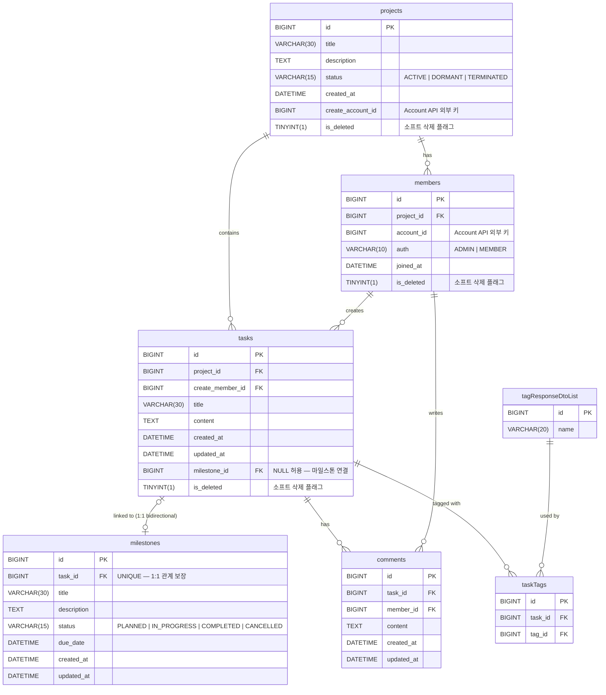
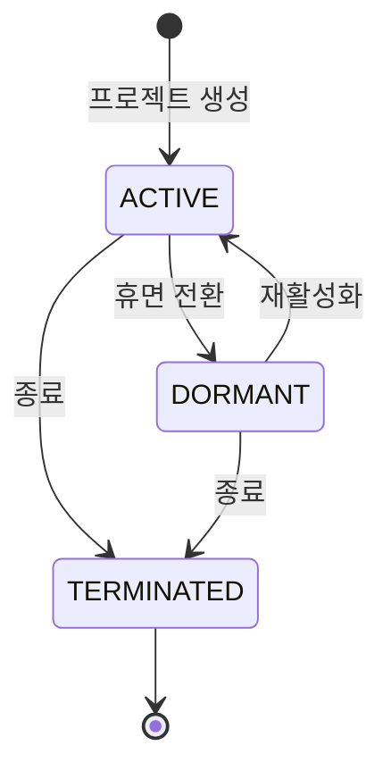
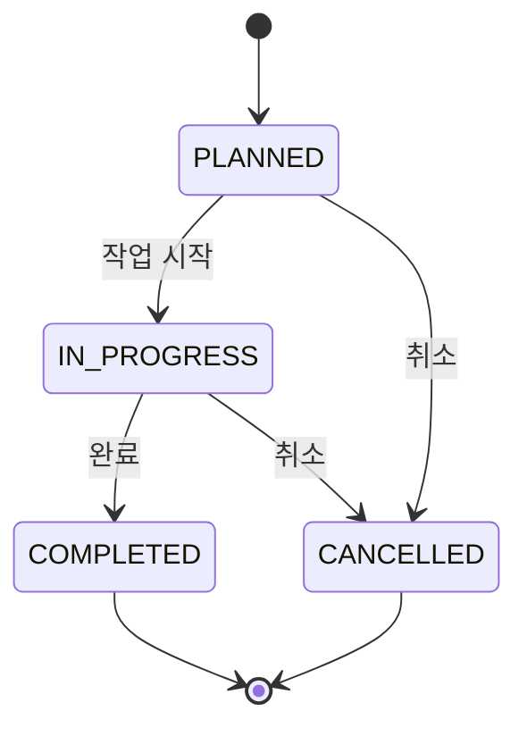

# miniDooray TaskAPI — ERD

## 엔티티 관계 다이어그램



---

## 관계 설명

| 관계 | 카디널리티 | 설명 |
|------|-----------|------|
| projects → members | 1:N | 하나의 프로젝트에 여러 멤버 소속 |
| projects → tasks | 1:N | 하나의 프로젝트에 여러 태스크 존재 |
| members → tasks | 1:N | 멤버가 여러 태스크 생성 |
| tasks ↔ milestones | 1:1 (양방향) | 태스크 하나에 마일스톤 하나 연결 (선택) |
| tasks → comments | 1:N | 하나의 태스크에 여러 댓글 |
| members → comments | 1:N | 멤버가 여러 댓글 작성 |
| tasks → taskTags | 1:N | 태스크에 여러 태그 부착 (M:N 연결 테이블) |
| tagResponseDtoList → taskTags | 1:N | 태그 하나가 여러 태스크에 사용 |

### 순환 참조 (tasks ↔ milestones)

`tasks.milestone_id` ↔ `milestones.task_id` 의 양방향 OneToOne FK 구조로 인해 DDL 생성 시 순환 참조가 발생합니다.

**해결 방법**: `tasks` 테이블을 먼저 생성한 뒤 `milestones` 테이블을 생성하고, `ALTER TABLE tasks ADD CONSTRAINT` 로 `milestone_id` FK를 사후 추가합니다.

```
tasks 생성 (milestone_id FK 없이)
   ↓
milestones 생성 (task_id FK → tasks)
   ↓
ALTER TABLE tasks ADD CONSTRAINT fk_tasks_milestone (milestone_id → milestones)
```

---

## 상태 / 열거형 값

### ProjectStatus



| 값 | 설명 |
|----|------|
| `ACTIVE` | 활성 (기본값) |
| `DORMANT` | 휴면 |
| `TERMINATED` | 종료 |

### MileStoneStatus



| 값 | 설명 |
|----|------|
| `PLANNED` | 예정 (기본값) |
| `IN_PROGRESS` | 진행 중 |
| `COMPLETED` | 완료 |
| `CANCELLED` | 취소 |

### MembersAuth

| 값 | 설명 |
|----|------|
| `ADMIN` | 관리자 (프로젝트 생성자) |
| `MEMBER` | 일반 멤버 |

---

## 소프트 삭제 패턴

`projects`, `members`, `tasks` 테이블은 `is_deleted` 컬럼(TINYINT 0/1)으로 소프트 삭제를 구현합니다. 물리적 행 삭제 없이 `is_deleted = 1` 로 비활성화하여 데이터 이력을 보존합니다.

| 테이블 | is_deleted |
|--------|-----------|
| projects | O |
| members | O |
| tasks | O |
| milestones | X (태스크 삭제 시 연쇄) |
| comments | X (태스크 삭제 시 연쇄) |
| tagResponseDtoList | X |
| taskTags | X |

---

## 외부 의존성

`account_id` / `create_account_id` 컬럼은 Account API(`http://localhost:8081/account-api/v1/accounts`)에서 관리하는 계정 ID를 참조합니다. 이 값은 DB FK로 연결되지 않으며, Account API 호출을 통해 유효성을 검증합니다.