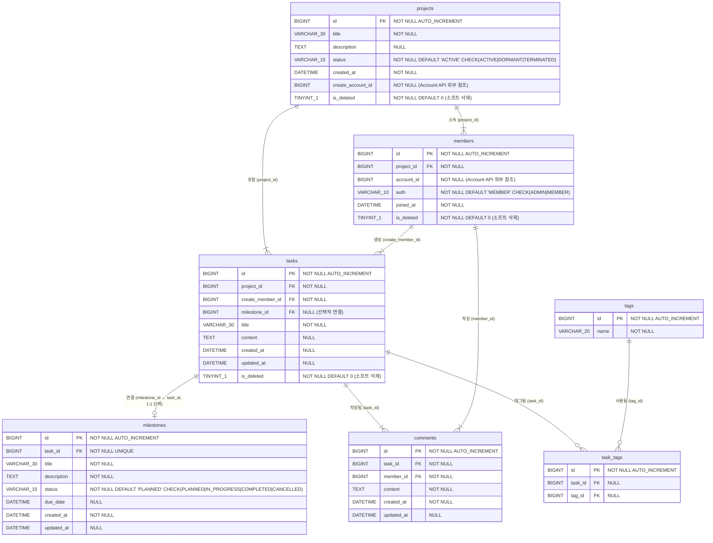
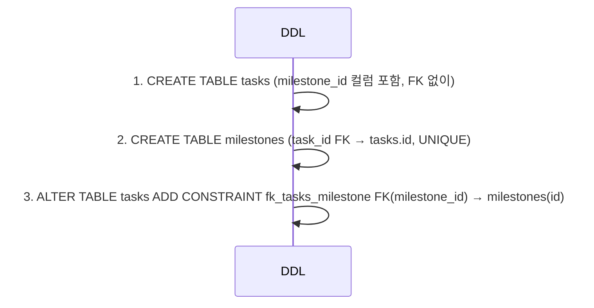
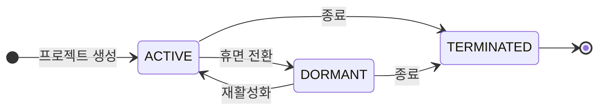
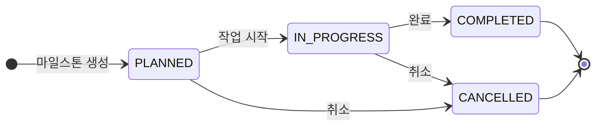

# miniDooray-TaskAPI ERD

## 엔티티 관계 다이어그램



> **주의**: `tags` 테이블의 실제 테이블명은 `tagResponseDtoList`이며, `task_tags`의 실제 테이블명은 `taskTags`입니다.  
> `account_id` / `create_account_id` 컬럼은 Account API의 계정 ID를 참조하나 DB FK 제약은 없고 API 호출로 유효성을 검증합니다.

---

## 테이블 상세

### projects

| 컬럼명 | 데이터 타입 | NOT NULL | KEY | DEFAULT | 설명 |
|--------|------------|:--------:|-----|---------|------|
| id | BIGINT | ✅ | PK | AUTO_INCREMENT | 프로젝트 고유 식별자 |
| title | VARCHAR(30) | ✅ | — | — | 프로젝트 제목 |
| description | TEXT | — | — | — | 프로젝트 설명 |
| status | VARCHAR(15) | ✅ | — | `ACTIVE` | 프로젝트 상태 (CHECK 제약) |
| created_at | DATETIME | ✅ | — | — | 프로젝트 생성일시 |
| create_account_id | BIGINT | ✅ | — | — | 생성자 계정 ID (Account API 참조) |
| is_deleted | TINYINT(1) | ✅ | — | `0` | 소프트 삭제 플래그 |

**제약 조건**
- `chk_projects_status` : CHECK (status IN ('ACTIVE', 'DORMANT', 'TERMINATED'))

---

### members

| 컬럼명 | 데이터 타입 | NOT NULL | KEY | DEFAULT | 설명 |
|--------|------------|:--------:|-----|---------|------|
| id | BIGINT | ✅ | PK | AUTO_INCREMENT | 멤버 고유 식별자 |
| project_id | BIGINT | ✅ | FK | — | 소속 프로젝트 (`projects.id`) |
| account_id | BIGINT | ✅ | — | — | 계정 ID (Account API 참조) |
| auth | VARCHAR(10) | ✅ | — | `MEMBER` | 권한 (CHECK 제약) |
| joined_at | DATETIME | ✅ | — | — | 프로젝트 참여일시 |
| is_deleted | TINYINT(1) | ✅ | — | `0` | 소프트 삭제 플래그 |

**제약 조건**
- `fk_members_project` : FK (project_id) → projects(id)
- `chk_members_auth` : CHECK (auth IN ('ADMIN', 'MEMBER'))

---

### tasks

| 컬럼명 | 데이터 타입 | NOT NULL | KEY | DEFAULT | 설명 |
|--------|------------|:--------:|-----|---------|------|
| id | BIGINT | ✅ | PK | AUTO_INCREMENT | 태스크 고유 식별자 |
| project_id | BIGINT | ✅ | FK | — | 소속 프로젝트 (`projects.id`) |
| create_member_id | BIGINT | ✅ | FK | — | 생성 멤버 (`members.id`) |
| milestone_id | BIGINT | — | FK | NULL | 연결 마일스톤 (`milestones.id`, 선택) |
| title | VARCHAR(30) | ✅ | — | — | 태스크 제목 |
| content | TEXT | — | — | — | 태스크 내용 |
| created_at | DATETIME | — | — | — | 생성일시 |
| updated_at | DATETIME | — | — | — | 수정일시 |
| is_deleted | TINYINT(1) | ✅ | — | `0` | 소프트 삭제 플래그 |

**제약 조건**
- `fk_tasks_project` : FK (project_id) → projects(id)
- `fk_tasks_member` : FK (create_member_id) → members(id)
- `fk_tasks_milestone` : FK (milestone_id) → milestones(id) ← ALTER TABLE로 후추가

---

### milestones

| 컬럼명 | 데이터 타입 | NOT NULL | KEY | DEFAULT | 설명 |
|--------|------------|:--------:|-----|---------|------|
| id | BIGINT | ✅ | PK | AUTO_INCREMENT | 마일스톤 고유 식별자 |
| task_id | BIGINT | ✅ | FK, UK | — | 연결 태스크 (`tasks.id`, 1:1 보장) |
| title | VARCHAR(30) | ✅ | — | — | 마일스톤 제목 |
| description | TEXT | ✅ | — | — | 마일스톤 설명 |
| status | VARCHAR(15) | ✅ | — | `PLANNED` | 진행 상태 (CHECK 제약) |
| due_date | DATETIME | — | — | — | 목표 완료일 |
| created_at | DATETIME | ✅ | — | — | 생성일시 |
| updated_at | DATETIME | — | — | — | 수정일시 |

**제약 조건**
- `uk_milestones_task_id` : UNIQUE (task_id) — tasks와 1:1 보장
- `fk_milestones_task` : FK (task_id) → tasks(id)
- `chk_milestones_status` : CHECK (status IN ('PLANNED', 'IN_PROGRESS', 'COMPLETED', 'CANCELLED'))

---

### comments

| 컬럼명 | 데이터 타입 | NOT NULL | KEY | DEFAULT | 설명 |
|--------|------------|:--------:|-----|---------|------|
| id | BIGINT | ✅ | PK | AUTO_INCREMENT | 댓글 고유 식별자 |
| task_id | BIGINT | ✅ | FK | — | 소속 태스크 (`tasks.id`) |
| member_id | BIGINT | ✅ | FK | — | 작성 멤버 (`members.id`) |
| content | TEXT | ✅ | — | — | 댓글 내용 |
| created_at | DATETIME | ✅ | — | — | 작성일시 |
| updated_at | DATETIME | — | — | — | 수정일시 |

**제약 조건**
- `fk_comments_task` : FK (task_id) → tasks(id)
- `fk_comments_member` : FK (member_id) → members(id)

---

### tags  *(실제 테이블명: `tagResponseDtoList`)*

| 컬럼명 | 데이터 타입 | NOT NULL | KEY | DEFAULT | 설명 |
|--------|------------|:--------:|-----|---------|------|
| id | BIGINT | ✅ | PK | AUTO_INCREMENT | 태그 고유 식별자 |
| name | VARCHAR(20) | ✅ | — | — | 태그 이름 |

---

### task_tags  *(실제 테이블명: `taskTags`)*

| 컬럼명 | 데이터 타입 | NOT NULL | KEY | DEFAULT | 설명 |
|--------|------------|:--------:|-----|---------|------|
| id | BIGINT | ✅ | PK | AUTO_INCREMENT | 연결 고유 식별자 |
| task_id | BIGINT | — | FK | NULL | 태스크 (`tasks.id`) |
| tag_id | BIGINT | — | FK | NULL | 태그 (`tagResponseDtoList.id`) |

**제약 조건**
- `fk_tasktags_task` : FK (task_id) → tasks(id)
- `fk_tasktags_tag` : FK (tag_id) → tagResponseDtoList(id)

---

## 관계 요약

| 관계 | 카디널리티 | FK 위치 | 설명 |
|------|:----------:|---------|------|
| projects → members | 1 : N | members.project_id | 프로젝트에 여러 멤버 소속 |
| projects → tasks | 1 : N | tasks.project_id | 프로젝트에 여러 태스크 |
| members → tasks | 1 : N | tasks.create_member_id | 멤버가 여러 태스크 생성 |
| tasks ↔ milestones | 1 : 0..1 | tasks.milestone_id + milestones.task_id(UK) | 태스크 하나에 마일스톤 하나 (선택, 양방향) |
| tasks → comments | 1 : N | comments.task_id | 태스크에 여러 댓글 |
| members → comments | 1 : N | comments.member_id | 멤버가 여러 댓글 작성 |
| tasks ↔ tags | N : M | task_tags (연결 테이블) | 태스크에 여러 태그, 태그는 여러 태스크에 사용 |

---

## 순환 참조 해결 (tasks ↔ milestones)



---

## 상태 흐름

### ProjectStatus



### MilestoneStatus



---

## 소프트 삭제 대상 테이블

| 테이블 | is_deleted | 설명 |
|--------|:----------:|------|
| projects | ✅ | 프로젝트 삭제 시 is_deleted = 1 |
| members | ✅ | 멤버 탈퇴 시 is_deleted = 1 |
| tasks | ✅ | 태스크 삭제 시 is_deleted = 1 |
| milestones | ❌ | 태스크 삭제 시 연쇄 처리 |
| comments | ❌ | 태스크 삭제 시 연쇄 처리 |
| tags | ❌ | 독립적으로 관리 |
| task_tags | ❌ | 태스크/태그 삭제 시 연쇄 처리 |

---

## 외부 의존성 (Account API)

```
TaskAPI DB ──(논리 참조)──▶ AccountAPI
  projects.create_account_id ──▶ account.id
  members.account_id         ──▶ account.id
```

물리적 FK 없음. 계정 유효성은 Account API (`GET /account-api/v1/accounts/{id}`) 호출로 검증합니다.